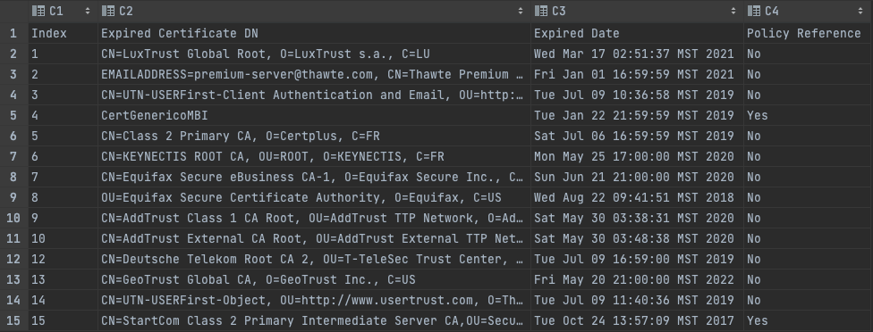
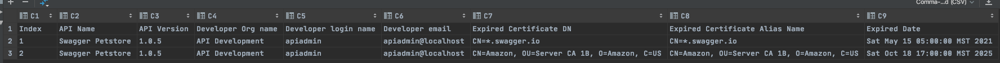

# APIM Policy and API Manager Certficate Expiry Report CLI tooll
## Policy Certificate Expiry Report

### Usage

```bash
$/home/axway/Axway-7.7.0-March/apigateway/posix/bin/jython expiredCertReport.py --help
Usage: expiredCertReport [options]

Generate report for Expired certificates from policies

Options:
  -h, --help            show this help message and exit
  --fedPath=FEDPATH     .fed file path e.g : /home/axway/dev.fed
  --policyProjDir=POLICYPROJDIR
                        Policy project directory e.g:
                        /home/axway/apiprojects/dev
  --daysBeforeExpires=DAYSBEFOREEXPIRES
                        "Days Before Expires e.g: 7
```

### Create Certificate Expiry Report

- Below command geneates a file named output.csv

```bash
/home/axway/Axway-7.7.0-March/apigateway/posix/bin/jython expiredCertReport.py --daysBeforeExpires 365 --policyProjDir /home/axway/apiprojects/QuickStart/
```

### Sample Report



```csv
Index,Expired Certificate DN,Expired Date,Policy Reference
1,"CN=LuxTrust Global Root, O=LuxTrust s.a., C=LU",Wed Mar 17 02:51:37 MST 2021,No
2,"EMAILADDRESS=premium-server@thawte.com, CN=Thawte Premium Server CA, OU=Certification Services Division, O=Thawte Consulting cc, L=Cape Town, ST=Western Cape, C=ZA",Fri Jan 01 16:59:59 MST 2021,No
3,"CN=UTN-USERFirst-Client Authentication and Email, OU=http://www.usertrust.com, O=The USERTRUST Network, L=Salt Lake City, ST=UT, C=US",Tue Jul 09 10:36:58 MST 2019,No
4,"CertGenericoMBI",Tue Jan 22 21:59:59 MST 2019,Yes
5,"CN=Class 2 Primary CA, O=Certplus, C=FR",Sat Jul 06 16:59:59 MST 2019,No
6,"CN=KEYNECTIS ROOT CA, OU=ROOT, O=KEYNECTIS, C=FR",Mon May 25 17:00:00 MST 2020,No
7,"CN=Equifax Secure eBusiness CA-1, O=Equifax Secure Inc., C=US",Sun Jun 21 21:00:00 MST 2020,No
8,"OU=Equifax Secure Certificate Authority, O=Equifax, C=US",Wed Aug 22 09:41:51 MST 2018,No
9,"CN=AddTrust Class 1 CA Root, OU=AddTrust TTP Network, O=AddTrust AB, C=SE",Sat May 30 03:38:31 MST 2020,No
10,"CN=AddTrust External CA Root, OU=AddTrust External TTP Network, O=AddTrust AB, C=SE",Sat May 30 03:48:38 MST 2020,No
11,"CN=GTE CyberTrust Global Root, OU="GTE CyberTrust Solutions, Inc.", O=GTE Corporation, C=US",Mon Aug 13 16:59:00 MST 2018,No
12,"CN=Deutsche Telekom Root CA 2, OU=T-TeleSec Trust Center, O=Deutsche Telekom AG, C=DE",Tue Jul 09 16:59:00 MST 2019,No
13,"CN=GeoTrust Global CA, O=GeoTrust Inc., C=US",Fri May 20 21:00:00 MST 2022,No
14,"CN=UTN-USERFirst-Object, OU=http://www.usertrust.com, O=The USERTRUST Network, L=Salt Lake City, ST=UT, C=US",Tue Jul 09 11:40:36 MST 2019,No
15,"CN=StartCom Class 2 Primary Intermediate Server CA,OU=Secure Digital Certificate Signing,O=StartCom Ltd.,C=IL",Tue Oct 24 13:57:09 MST 2017,Yes
```


## API manager Certificate Expiry Report

### Build project

```bash
$mvn package
```

mvn package command creates a jar file named target/apimanager-cert-expiry-check-1.0.1.jar

### Usage

```bash
$java -jar target/apimanager-cert-expiry-check-1.0.1.jar
Usage: checkCertificateExpiry [-hV] -d=<daysBeforeExpires> -p=<password>
                              -s=<url> -u=<username>
AMPLIFY APIM V7 Certificate Expiry  Checker
  -d, --daysBeforeExpires=<daysBeforeExpires>
                          Days Before Expires
  -h, --help              Show this help message and exit.
  -p, --password=<password>
                          APIManager password
  -s, --serverURL=<url>   API Manager URL
  -u, --username=<username>
                          APIManager Username
  -V, --version           Print version information and exit.
```
### Create certificate expiry report

```bash
$java -jar target/apimanager-cert-expiry-check-1.0.1.jar -u apiadmin -p changeme -s https://10.129.59.81:8075 -d 7
```

The script creates a csv file named output.csv in a current directory if there are expired certificate on API manger. (To test the functionality change your system timezone to future date )

### Sample Report



```html
Index,API Name,API Version,Developer Org name,Developer login name,Developer email,Expired Certificate DN,Expired Certificate Alias Name,Expired Date
1,Swagger Petstore,1.0.5,API Development,apiadmin,apiadmin@localhost,"CN=*.swagger.io","CN=*.swagger.io",Sat May 15 05:00:00 MST 2021
2,Swagger Petstore,1.0.5,API Development,apiadmin,apiadmin@localhost,"CN=Amazon, OU=Server CA 1B, O=Amazon, C=US","CN=Amazon, OU=Server CA 1B, O=Amazon, C=US",Sat Oct 18 17:00:00 MST 2025
```

